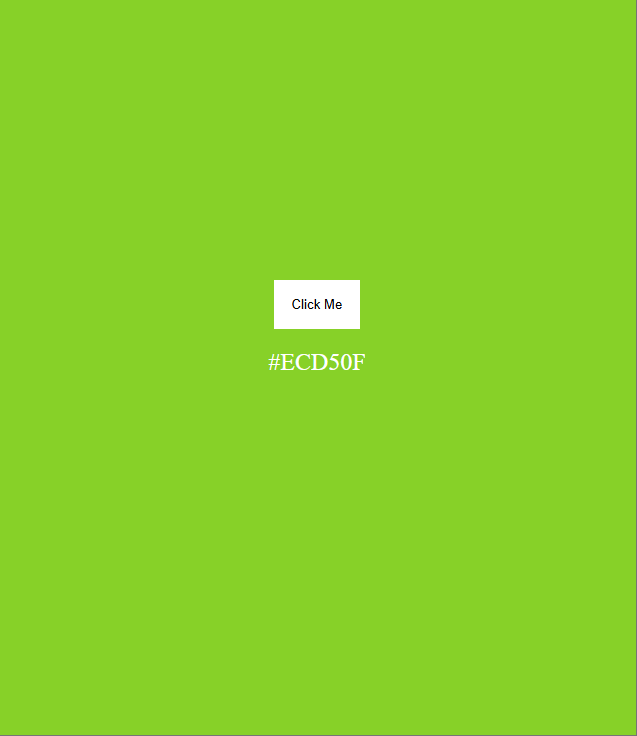

# 🎨 Background Color Changer

A simple and fun **JavaScript project** that changes the background color of a webpage every time you click the button.  
It uses random HEX color generation to make your page look different each time!

## 🖼️ 

## ⚙️ Features

- Generates random HEX color codes  
- Updates the background instantly  
- Displays the color code on screen (optional)  
- Built with **HTML**, **CSS**, and **JavaScript** only  
